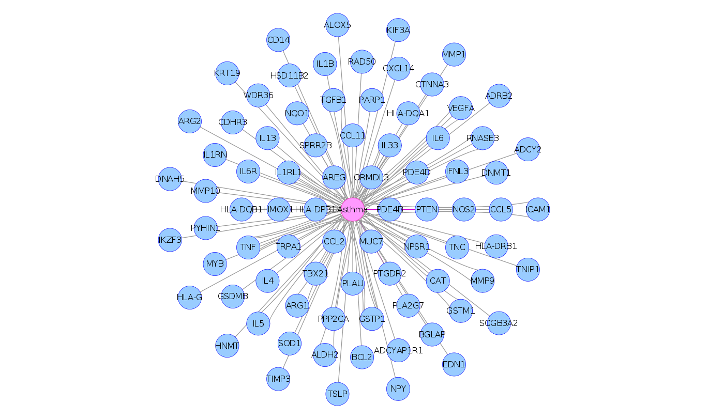
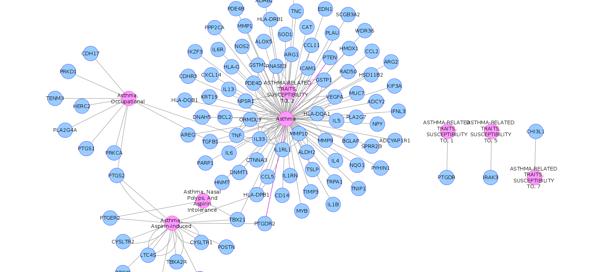
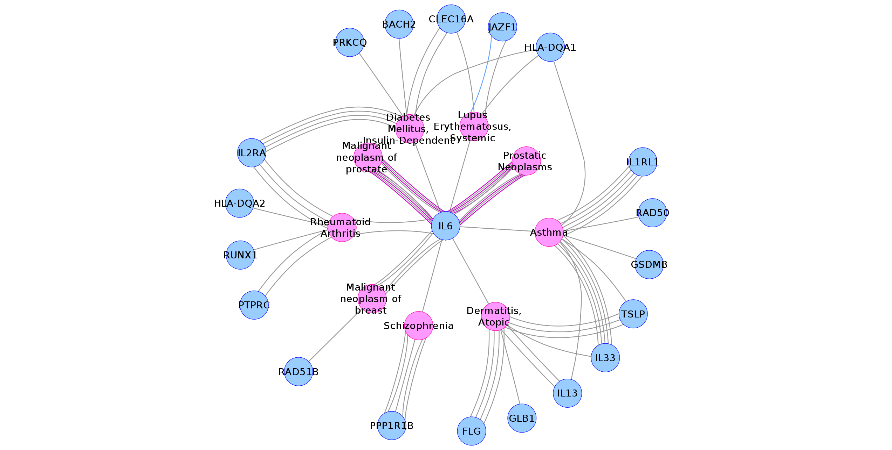
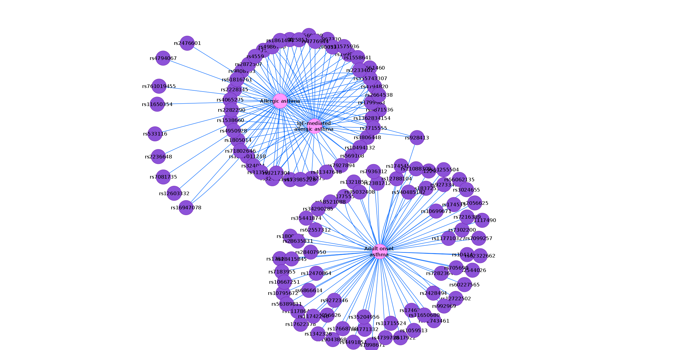
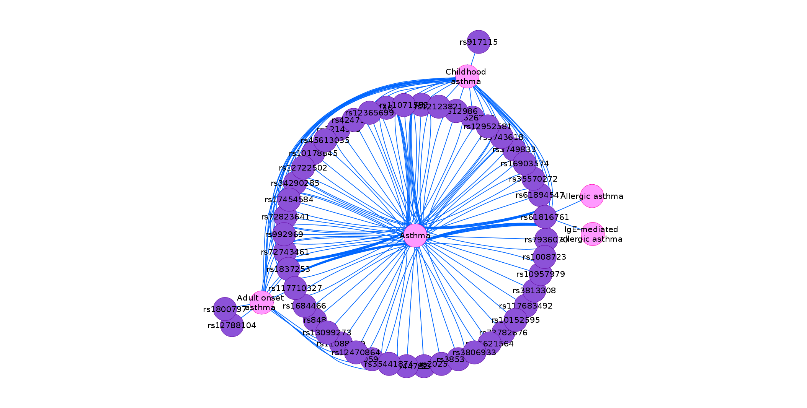
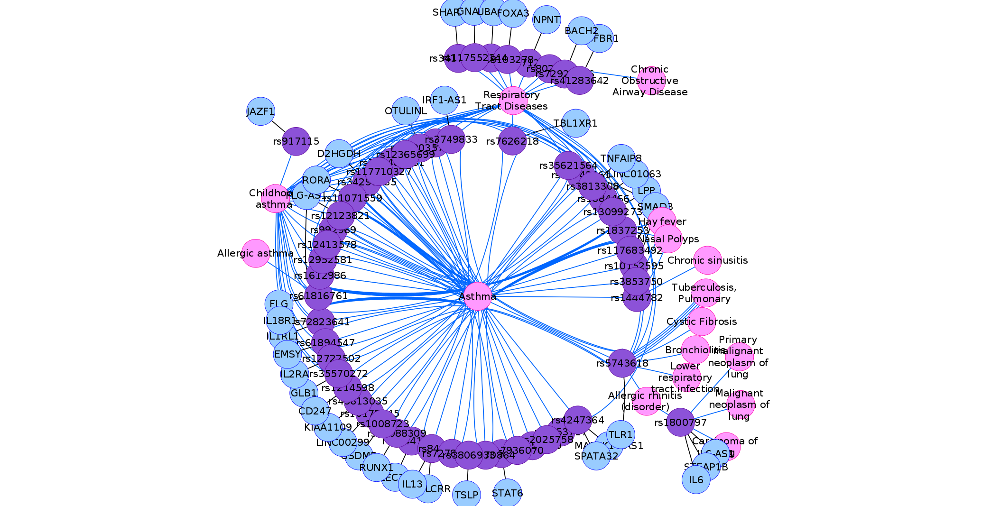
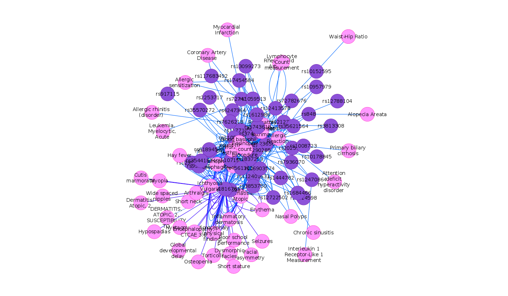

```{r, echo = FALSE}
knitr::opts_chunk$set(
  eval=TRUE
)

```
*The R markdown is available from the pulldown menu for* Code *at the upper-right, choose "Download Rmd", or [download the Rmd from GitHub](https://github.com/jpinero/disgenet-app-notebook/blob/main/DisGeNET_App.Rmd).*
<hr /> 

# Introduction 

This tutorial will teach you how to use the [DisGeNET Cytoscape App](http://apps.cytoscape.org/apps/disgenetapp) to retrieve data from [DisGeNET](https://www.disgenet.org/) [1] using the R programming language. A tutorial on how to use the DisGeNET Cytoscape App from Cytoscape is available [here](https://www.disgenet.org/static/disgenet_ap1/files/current/DisGeNET_Cytoscape_v7.pdf). 


**About DisGeNET**  

DisGeNET is a discovery platform containing one of the largest publicly available collections of genes and variants associated with human diseases [1]. DisGeNET integrates data from expert curated repositories, GWAS catalogues, animal models and the scientific literature. The data in the platform are homogeneously annotated with controlled vocabularies and community-driven ontologies. Additionally, several original metrics are provided to assist the prioritization of genotype–phenotype relationships. More information on the database contents, statistics and attributes is available [here](https://www.disgenet.org/dbinfo).

**Requirements**

To run the tutorial you will need to install **RCy3**:

```{r}
if(!"RCy3" %in% installed.packages()){
    if (!requireNamespace("BiocManager", quietly=TRUE))
        install.packages("BiocManager")
    BiocManager::install("RCy3")
}
library(RCy3)
```


You will also need to install and launch Cytoscape:

* Download the latest [Cytoscape](https://cytoscape.org/download.html)
* Complete the installation wizard
* Launch Cytoscape

```{r,eval=F}
cytoscapePing()
```

Finally, install the DisGENET App to access DisGeNET from within Cytoscape. This can be done from the [Cytoscape App Store](http://apps.cytoscape.org/apps/disgenetapp) or, if you are running Cytoscape 3.7.0 or above, by simply running this command:

```{r, eval=F}
installApp('DisGeNET')  #only available in Cytoscape 3.7.0 and above
```

Then, install and load the library *httr*


```{r, eval=F}
install.packages("httr")
```

```{r}
library(httr)
```

# Tutorial 

This tutorial will guide you on how to use the [DisGeNET Cytoscape App](http://apps.cytoscape.org/apps/disgenetapp) to:  
   
* Create a GDA network associated to a disease (using disease identifiers or strings as search input)  
* Create a GDA network associated to a list of genes   
* Create a VDA network associated to a list of diseases or a list of variants   
* Perform a disease enrichment analyses on a list of variants or a list of genes   


We will create an object for the REST calls to the DisGeNET automation module. The parameters are:


- *netType*: A string containing the type of the network to be created (*gene-disease-net*,*variant-disease-net*, *gene-enrichment*, *variant-enrichment*, etc)
- *host*: The host of the url.  
- *port*: The listening port, by default 1234. 
- *version*: The version of the automation module, by default v7.  

The function returns a string in url format (*url*), with the given parameters.

```{r}

disgenetRestUrl<-function(netType,host="127.0.0.1",port=1234,version="v7"){
  if(is.null(netType)){
    print("Network type not specified.")
  }else{
    url<-sprintf("http://%s:%i/disgenet/%s/%s",host,port,version,netType)
  }
  return (url)
}

# Creating the url for GDAs
disgenetRestUrl(netType = "gene-disease-net")

```

Next, we will create an object that will execute the REST calls to the DisGeNET automation module in Cytoscape and retrieve the operation results. The parameters are: 

- *netType*: A string containing the type of the network to be created (*gene-disease-net*,*variant-disease-net*, *gene-enrichment*, *variant-enrichment*, etc)
- *netParams*: A list with the parameters to create the network.

The function returns the object *result*, a list with the results of the operation.

```{r}

disgenetRestCall<-function(netType,netParams){
  url<-disgenetRestUrl(netType)
  restCall<-POST(url, body = netParams, encode = "json")
  result<-content(restCall,"parsed")
  return(result)
}
```


## Create a GDA network associated to a disease  


In this example, we will create a gene-disease network for Asthma using the CURATED data in DisGeNET. Below, an example of the object *netParams* to create the GDA network 

```{r}
geneDisParams <- list(
  source = "CURATED",
  diseaseSearch = "Asthma",
  geneSearch = " ",
  initialScoreValue = "0.0",
  finalScoreValue = "1.0"
)

# Generate the gene-disease network
geneDisResult <- disgenetRestCall("gene-disease-net",geneDisParams)

```

The network has now been created in Cytoscape!

To change the layout, run the function *layoutNetwork*. This function receives as an input the network identifier, and a layout name. To investigate the names of the possible layouts, run the function *getLayoutNames()*.


```{r}
layoutNetwork("force-directed", network = as.numeric(geneDisResult$result$networkSUID))
```

You can also change the network title, for example:

```{r}
title <- "my-asthma-GDA-network"
renameNetwork(title, network =   as.numeric(geneDisResult$result$networkSUID))

```


<center>
{width=80%}
</center>

**Create a GDA network associated to a disease using a keyword as input**

In this example, we will create a gene-disease network for the diseases containing the keyword *Asthma* using DisGeNET CURATED data


```{r}
geneDisParams <- list(
  source = "CURATED",
  diseaseSearch = "*Asthma*",
  geneSearch = " ",
  initialScoreValue = "0.1",
  finalScoreValue = "1.0"
)
geneDisResult <- disgenetRestCall("gene-disease-net",geneDisParams)
layoutNetwork("force-directed", network = geneDisResult$networkResult$networkName)

```


<center>
{width=100%}
</center>


## Create a GDA network associated to a list of genes or diseases


```{r}

list <-  c("TBX21", "IL5", "IL13", "CCL11", "TGFB1", "ICAM1", "IL4", "IL6", "MMP9", "NOS2", "CCL2", "CCL5", "SCGB3A2", "ADRB2", "ALOX5",  "GSDMB",  "TSLP", "IL33")
geneDisParams <- list(
  source = "CURATED",
  geneSearch = paste(list, collapse = ";"),
  diseaseSearch=  "",
  initialScoreValue = "0.6",
  finalScoreValue = "1.0"
)

geneDisResult <- disgenetRestCall("gene-disease-net",geneDisParams)

```
 
<center>
{width=100%}


##  Create a VDA network associated to a list of diseases or variants  

In this example, we will create a VDA network associated to:

- Allergic asthma, C0155877  
- Adult onset asthma, C0741260   
- IgE-mediated allergic asthma, C1827849   

```{r}

variantDisParams <- list(
  source= "ALL",
  diseaseSearch= "Allergic asthma;Adult onset asthma;IgE-mediated allergic asthma",
  initialScoreValue= "0.0",
  finalScoreValue = "1.0",
  showGenes= "false"
)

variantDisResult <- disgenetRestCall("variant-disease-net",variantDisParams)
layoutNetwork("kamada-kawai" , network = variantDisResult$networkResult$networkName)

```


<center>
{width=100%} 
</center>

For the following examples, we will use the [data](https://static-content.springer.com/esm/art%3A10.1038%2Fs41467-019-14144-8/MediaObjects/41467_2019_14144_MOESM4_ESM.xlsx) from the publication [Eighty-eight variants highlight the role of T cell regulation and airway remodeling in asthma pathogenesis](https://www.nature.com/articles/s41467-019-14144-8). The publication reports a genome-wide association meta-analysis of 69,189 cases and 702,199 controls from Iceland and UK biobank. They find 88 asthma risk variants at 56 loci.

We have made the data available with this tutorial. To read the list of variants, run

```{r}

variants <-read.csv("https://raw.githubusercontent.com/jpinero/disgenet-app-notebook/main/data/variants.tsv")
variants <- variants$x

```

There are  `r length(variants)` variants in total


**Create a VDA network associated to a list of variants**

We will create the network of the variants from the GWAS study that are already described as related to asthma. 

```{r}

variantDisParams <- list(
  source= "ALL",
  diseaseSearch= "*asthma*",
  variantSearch=  paste(variants, collapse = ";"), 
  initialScoreValue= "0.0",
  finalScoreValue = "1.0",
  showGenes= "false"
)


variantDisResult <- disgenetRestCall("variant-disease-net",variantDisParams)

layoutNetwork('force-directed defaultSpringCoefficient=0.0001 defaultSpringLength=10')

# We will store the network identifiers to perform the enrichment later 
suid <- as.numeric(variantDisResult$result$networkSUID)

```


<center>
{width=100%}
</center>


We can retrieve the information associated to the network nodes and edges like this: 

```{r}
nodes <-getTableColumns('node')
edges <-getTableColumns('edge')

```

Let's explore data

```{r, message=F}
library(dplyr)
library(DT)
dt  <- nodes %>% filter(nodeType=="disease") %>%  arrange(desc(nrAssociatedVariants)) %>% select(diseaseId,diseaseName, nrAssociatedVariants)

datatable(dt, caption = "Table 1: Variants associated to Asthma" ,  rownames = FALSE, class = 'cell-border stripe', filter = 'top',
          options = list( pageLength = length(dt$diseaseName),  autoWidth = TRUE,   columnDefs = list(list(width = '100px',  targets = c(0, 1,2))) ))

```

Let's explore the evidence (represented as the edges in the network). We will show only the first 10 rows.

```{r}
dt  <- edges %>% select(score, sentence, pmid) %>% arrange(desc(score)) %>% unique() %>% head(10)
datatable(dt, caption = "Table 2: Evidences supporting the associations with Asthma" ,  rownames = FALSE, class = 'cell-border stripe', filter = 'top',
              options = list(   pageLength = 20, autoWidth = T, 
                                columnDefs = list(list(width = '100px', targets = c(0, 2)))))


```

Next we will create a VDA network for a list of variants filtering by disease class. We will retrieve the network of diseases belonging to the class *Respiratory Tract Diseases* associated to the variants from the GWAS study. This time, we will specify the parameter *showGenes* as true. Notice that the genes annotated to the variants are now shown.


```{r}

variantDisParams <- list(
  source= "ALL",
  diseaseClass= "Respiratory Tract Diseases",
  variantSearch=  paste(variants, collapse = ";"), 
  initialScoreValue= "0.0",
  finalScoreValue = "1.0",
  showGenes= "true"
)


variantDisResult <- disgenetRestCall("variant-disease-net",variantDisParams)
layoutNetwork('force-directed defaultSpringCoefficient=0.0001 defaultSpringLength=10')


```


<center>
{width=100%}
</center>

## Perform a disease enrichment analyses on a list of variants or genes   


**Perform a variant enrichment analysis**

\noindent The **disease_enrichment** function receives the identifiers of the network containing the variants of interest, and performs an enrichment analysis over the diseases in DisGeNET. The input list of variants should be identified with DBSNP identifiers. The function has other mandatory arguments: 


- *networkId*: SUID of the network
- *columnName*: the name of the column containing the variants
- *source*: the source database (by default, `database = “CURATED”`)


The p-values resulting from the multiple Fisher tests are corrected for false discovery rate using the Benjamini-Hochberg method.

To retrieve the name of the column containing the variants

```{r}
# this retrieves the name of the columns of the node table of the network 
colnames(getTableColumns('node', network = suid))

```

To perform the enrichment:

```{r}
VarDisEnrichParams <- list(
  networkId = suid,
  columnName = "variantId",
  typeId = "DBSNP",  
  source =  "CURATED",
  newNetwork = "true"
)

vda_enrich_result <- disgenetRestCall("variant-enrichment",VarDisEnrichParams)
layoutNetwork('force-directed defaultSpringCoefficient=0.0001 defaultSpringLength=10')

```


<center>
{width=100%}
</center>


**Perform a gene enrichment analysis**

To perform a gene enrichment analysis, first it is necessary to create the network containing the genes of interest. We will use as an example the genes associated to the variants from the list of variants of the previous publication.  
First, load the data into R: 

```{r}

edges <-read.csv("https://raw.githubusercontent.com/jpinero/disgenet-app-notebook/main/data/variant_gene_network.tsv",sep = "\t")

```

There are  `r length(unique(edges$target))` genes in total

Next, we will create the nodes, and edges: 

```{r, message=F}
nodes <- data.frame( id = c(as.character(edges$target), as.character(edges$source)), 
                     group = c(rep("gene", length(edges$target)), rep("variant", length(edges$source))) )


net_res <- createNetworkFromDataFrames(nodes =nodes, edges = edges, title = "gene-variant-net")
layoutNetwork('circular')
setVisualStyle("BioPAX_SIF")

```

Once the network has been created, we will retrieve the network identifier

```{r}

suid <-as.numeric(net_res)

```


Now we are ready to perform the enrichment. The **disease_enrichment** function for the genes receives an object with the following parameters: 
 
- *networkId*: SUID of the network containing the list of genes of interest
- *columnName*: the name of the column containing the genes
- *typeId*: the identifier of the gene: **SYMBOL** for gene symbols, or **ENTREZID** for NCBI Gene Identifiers. 
- *source*: the source database (by default, `database = “CURATED”`)


The p-values resulting from the multiple Fisher tests are corrected for false discovery rate using the Benjamini-Hochberg method.


```{r}

getTableColumnNames(table = "node", network = suid)
genDisEnrichParams <- list(
  networkId = suid,
  columnName = "id",
  typeId = "SYMBOL",  
  source =  "CURATED",
  newNetwork = "true"
)

gda_enrich_result <- disgenetRestCall("gene-enrichment",genDisEnrichParams)
top_nodes <- getTableColumns('node')

top_nodes  <- top_nodes %>% filter(nrAssociatedGenes>4) %>%  arrange(desc(nrAssociatedGenes)) %>% select(diseaseId, diseaseName, nrAssociatedGenes)
datatable(top_nodes, caption = "Table 3: Top diseases resulting from the variant enrichment" ,  rownames = FALSE, class = 'cell-border stripe', filter = 'top',
              options = list(   pageLength = 10, autoWidth = T ))


```


 
# References

1. Piñero, Janet and Ramírez-Anguita, Juan Manuel and Saüch-Pitarch, Josep and Ronzano, Francesco and Centeno, Emilio, Sanz, Ferran and Furlong, Laura I, {The DisGeNET knowledge platform for disease genomics: 2019 update
, [Nucleic Acids Research, 48, Issue D1, D845–D85508 (2020)](https://academic.oup.com/nar/advance-article/doi/10.1093/nar/gkz1021/5611674) 

2. Olafsdottir, T.A., Theodors, F., Bjarnadottir, K. et al.Eighty-eight variants highlight the role of T cell regulation and airway remodeling in asthma pathogenesis. [Nat Commun 11, 393 (2020).](https://www.nature.com/articles/s41467-019-14144-8) 


